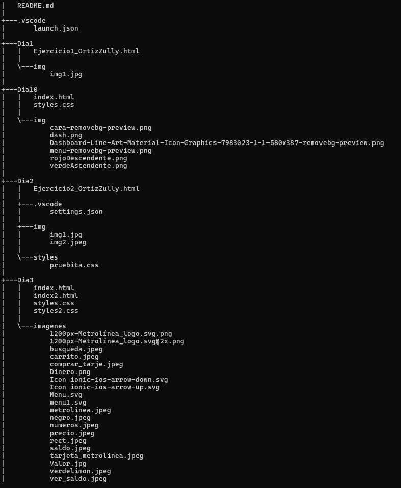
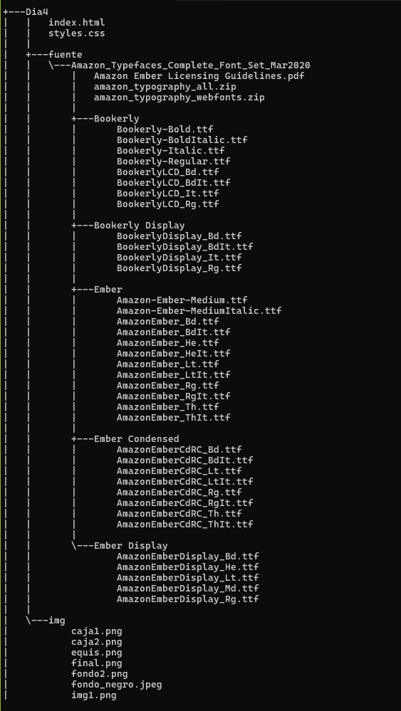
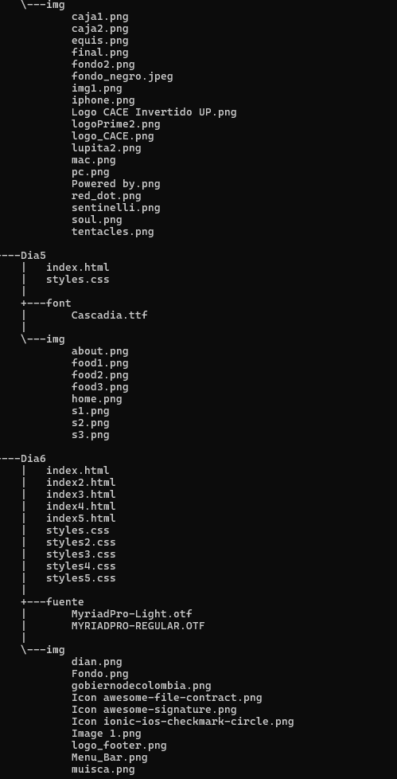
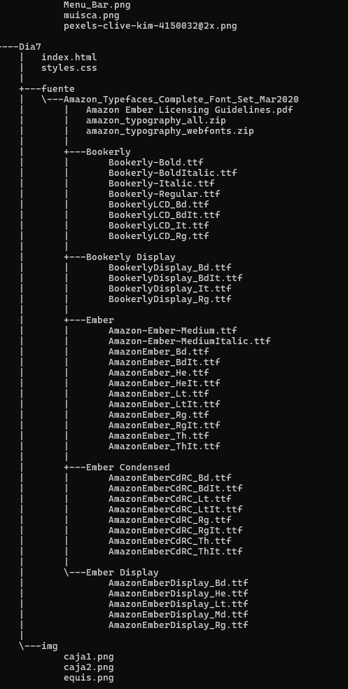
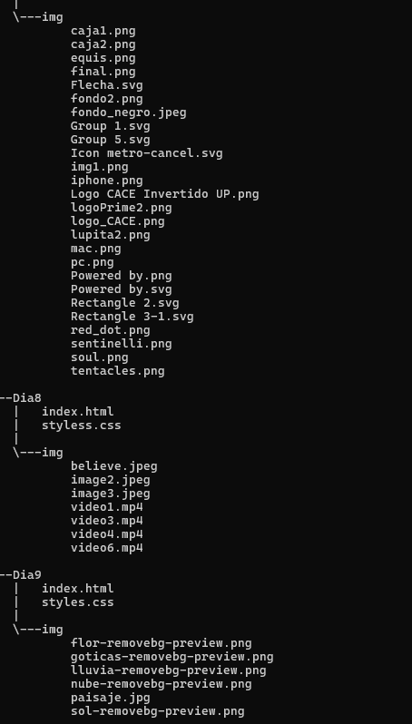

#  HTML_ORTIZZULLY

HTML_ORTIZZULLY es un repositorio donde tiene carpetas por dias, cada carpeta es un tema nuevo de HTML y CSS. donde llevo el proceso de aprendizaje de cada clase vista.

## Descripción del repositorio 

En este repositorio queda registrada tema visto en cada clase consta de 10 carpetas:

1.  *Dia1*:  Realización de estructura en HTML de la elaboración de mi poyecto de vida.

2. *Dia2*: Realizaciín de estructura en Html y estilos en CSS sonbre mi información personal. 

3. *DIA3*: Realizaciín de estructura en Html y estilos en CSS donde era recrear una tarjeta de metrolinea y que tuviera un hipervinculo. 

4. *DIA4*: Realizaciín de estructura en Html y estilos en CSS donde era recrear un blog de Amazon. 

5. *DIA5*: Realizaciín de estructura en Html y estilos en CSS donde era recrear una página de comidas. 

6. *DIA6*: Realizaciín de estructura en Html y estilos en CSS donde era recrear una página de DIAN. 

7. *DIA7*: retomar el trabajo de Amazon y hacer que la pagina sea responsive. 

8. *DIA8*: Realizaciín de estructura en Html y estilos en CSS donde era recrear una pagina animada utilizando uso de los los flexblox y grid. 

9. *DIA9*: Realizaciín de estructura en Html y estilos en CSS donde era recrear una animacion de un paisaje donde hicimos uso de las etiquetas de animaciones. 

10. *DIA10*: Realizaciín de estructura en Html y estilos en CSS donde era recrear una pagina con funcionalidad.

## Tecnologias usuadas en cada carpeta

En todas las carpetas hice uso de dos tecnologías:

* HTML5
* CSS3

## Estructura del repositorio

## Instruciones de uso 

* Clona este repositorio o descarga los archivos en tu máquina local.
* Abre el archivo index.html en un navegador web compatible.

## Creditos 

Este repositorio fue elaborado por Zully Fernanda Ortiz Avendaño Cc. 1092528097 con el fin de ir evidenciando el mejoramiento y proceso de mi rendimiento en CSS y HTML